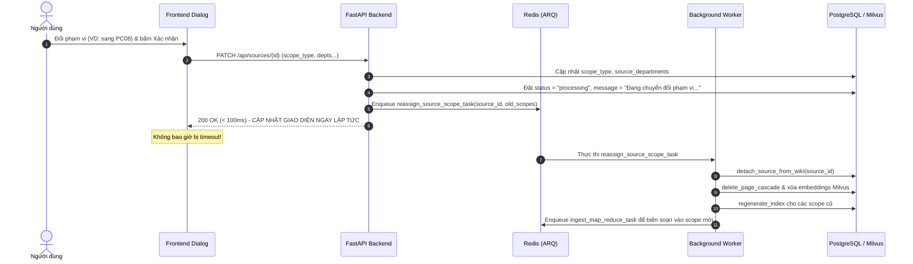

# Thiết Kế: Hệ Thống Phạm Vi Hiển Thị (Toàn Hệ Thống / Phòng Ban / Workspace) & Triệt Tiêu Timeout Khi Chuyển Phạm Vi

- **Ngày cập nhật:** 2026-09-24
- **Trạng thái:** Approved

---

## 1. Bối cảnh & Vấn đề (Context & Problem Statement)

### 1.1. Lỗi `Request timed out` khi chuyển đổi phòng ban/phạm vi
- Khi người dùng thay đổi phòng ban trên một tài liệu đã biên soạn xong (`status == "ready"`), endpoint `PATCH /api/sources/{source_id}` thực hiện toàn bộ việc tháo gỡ tài liệu (`detach_source_from_wiki`), xoá các trang wiki liên quan (`delete_page_cascade`), xoá vector embeddings (pgvector và Milvus), và tạo lại `_index` một cách **đồng bộ (synchronous)** trong request HTTP.
- Với các tài liệu lớn (như các văn bản luật pháp có hàng chục trang và hàng trăm chunk embeddings), tác vụ này tốn hơn 30 giây.
- Phía frontend (`frontend/src/lib/api.ts`) quy định `REQUEST_TIMEOUT_MS = 30_000` (30 giây), dẫn đến việc request bị ngắt kết nối và giao diện báo lỗi đỏ `Request timed out`.

### 1.2. Mâu thuẫn và bất cập trong giao diện chọn phạm vi
- Modal "Chỉnh sửa tài liệu" hiện chia làm 2 trường độc lập: **"Phòng ban"** (danh sách checkbox chọn nhiều phòng ban) và **"Phạm vi hiển thị"** (Dropdown gồm "Toàn Hệ Thống" và "Workspace").
- Việc chia tách này gây mâu thuẫn: người dùng vừa chọn "Toàn hệ thống" vừa tick phòng ban "PC08", khiến logic pipeline ưu tiên phòng ban và tài liệu không còn mang tính toàn hệ thống như người dùng lầm tưởng.
- Khi tài liệu đang trong quá trình xử lý (`inFlight`), modal khóa cứng toàn bộ việc chọn phòng ban và phạm vi hiển thị.
- Hộp thoại xác nhận biên soạn lại dùng sai key đa ngôn ngữ (`knowledge.edit.inFlight`) khiến người dùng thấy thông báo không đúng ngữ cảnh.
- *Lưu ý kiến trúc:* Hệ thống `document-wiki` phục vụ tri thức cho chatbot, tài khoản nhân sự hỏi đáp được lưu ở database bên ngoài, nên hệ thống phạm vi chỉ cần tập trung tối ưu vào 3 cấp độ: **Toàn hệ thống (Global)**, **Phòng ban (Department)**, và **Workspace (Project)**.

---

## 2. Mục tiêu (Goals & Non-Goals)

### Mục tiêu (Goals)
1. **Dứt điểm lỗi timeout:** Chuyển toàn bộ tác vụ dọn dẹp wiki cũ, xóa vector embeddings và tái tạo mục lục sang Background Worker (ARQ task `reassign_source_scope_task`). API `PATCH /api/sources/{id}` cập nhật DB và phản hồi ngay lập tức (`< 100ms`).
2. **Gộp chung 1 trường "Phạm vi hiển thị" (3 chế độ):** Thay thế 2 mục riêng rẽ thành 1 trường đồng nhất với 3 chế độ rõ ràng:
   - 🌐 `Toàn hệ thống (Global)`: Biên soạn vào wiki chung, mọi nhân sự đều có quyền truy cập.
   - 🏢 `Theo phòng ban (Department)`: Hiển thị bảng chọn phòng ban (chọn 1 hoặc nhiều phòng ban được cấp quyền truy cập).
   - 📁 `Theo Workspace (Project)`: Hiển thị dropdown chọn Workspace mục tiêu.
3. **Mở khóa linh hoạt:** Cho phép điều chỉnh phạm vi hiển thị bất cứ lúc nào, worker luôn áp dụng phạm vi mới nhất khi commit.
4. **Khắc phục UI bug:** Sửa đúng nội dung thông báo xác nhận biên soạn lại (`knowledge.edit.scopeChangeConfirm`) và nâng timeout phía client lên 60s.

### Ngoài phạm vi (Non-Goals)
- Không tạo bảng `source_users` vì tài khoản người dùng hỏi đáp nằm ở hệ thống ngoài.

---

## 3. Kiến trúc Chi Tiết (Detailed Architecture)

### 3.1. Chuẩn Hóa Scope Trong Dữ Liệu
Trong `Source` và `WikiPage`:
- `scope_type`:
  - `"global"`: Không cần `scope_id`, không cần phòng ban.
  - `"department"`: `scope_type = "department"`, liên kết với bảng `source_departments` (danh sách phòng ban được cấp quyền).
  - `"project"`: `scope_type = "project"`, `scope_id = project_id`.

Khi lưu:
- Nếu chọn `global`: xóa mọi liên kết `source_departments`, `scope_id = null`.
- Nếu chọn `department`: lưu danh sách phòng ban vào `source_departments`, `scope_id = null`.
- Nếu chọn `project`: xóa mọi liên kết `source_departments`, `scope_id = selected_project_id`.

---

### 3.2. Background Worker Hóa Thao Tác Chuyển Phạm Vi (Giải quyết Timeout)

#### Luồng xử lý khi người dùng đổi phạm vi trên tài liệu đã `ready`:

Request HTTP chỉ thực hiện lệnh UPDATE trong DB, hoàn tất chỉ trong khoảng **20ms - 50ms**, loại bỏ 100% rủi ro timeout.

---

### 3.3. Thiết Kế Giao Diện Frontend (UI/UX)

#### Trong `edit-source-dialog.tsx`:
1. **Trường "Phạm vi hiển thị" (Unified Scope Selector):**
   - Dropdown gồm 3 tùy chọn:
     - 🌐 **Toàn hệ thống (Global)** — Biên soạn vào wiki chung, hiển thị cho toàn bộ cán bộ.
     - 🏢 **Theo phòng ban (Department)** — Giới hạn truy cập cho các phòng ban được chỉ định.
     - 📁 **Theo Workspace (Project)** — Giới hạn trong phạm vi dự án / Workspace cụ thể.
2. **Khu vực lựa chọn phụ thuộc ngữ cảnh:**
   - Khi chọn **Theo phòng ban**: Mở danh sách checkbox các phòng ban với tag hiển thị đã chọn.
   - Khi chọn **Theo Workspace**: Mở danh sách chọn Workspace.
   - Khi chọn **Toàn hệ thống**: Hiển thị thông báo màu xanh/vàng thân thiện về việc tài liệu được tích hợp toàn hệ thống.
3. **Mở khóa khi đang xử lý:** Không khóa `disabled={inFlight}` trên trường phạm vi hiển thị.
4. **Hộp thoại xác nhận:**
   - Hiển thị thông báo tiếng Việt chính xác: *"Việc thay đổi phạm vi hiển thị sẽ kích hoạt biên soạn lại tri thức bằng AI. Bạn có muốn tiếp tục?"*
5. **Timeout Client:** Trong `frontend/src/lib/api.ts`, tăng `REQUEST_TIMEOUT_MS = 60_000` (60s).
